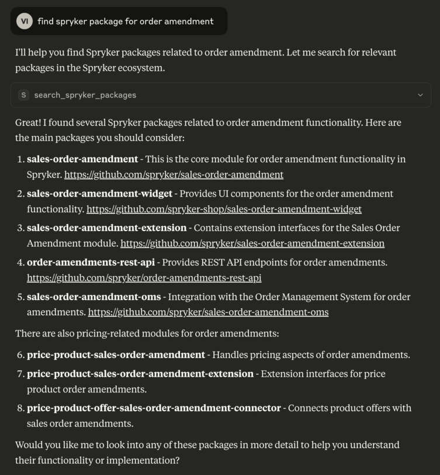

# Spryker Search Tool

A command-line tool that initializes a Model Context Protocol (MCP) server to provide **spryker search capabilities** for Spryker GitHub repositories.

This tool allows you to search Spryker packages and documentation or their code contents using natural language queries. It supports filtering by specific GitHub organizations.

---

## ✨ Features

- Search for Spryker packages on GitHub
- Search for Spryker public documentation https://docs.spryker.com/
- Code-level search across Spryker repositories
- Support for filtering by organization (`spryker`, `spryker-eco`, `spryker-sdk`, `spryker-shop`, `spryker-community`)
- Runs as an MCP server using stdio transport

---



https://5ire.app/


## 🚀 Installation

Ensure **npm** and **npx** are installed.

```bash
git clone
```

```bash
cd spryker-module-finder && npm install
```

## MCP server makes the tool compatible with various AI agents to extend context with Spryker Project context

### Tools:
- [Claude desktop](https://claude.ai/download)
- [JetBrains AI Assistant plugin](https://plugins.jetbrains.com/plugin/22282-jetbrains-ai-assistant)
- [Qodo Gen JetBrains plugin](https://plugins.jetbrains.com/plugin/21206-qodo-gen)
- [Windsurf](https://docs.windsurf.com/windsurf/mcp)
- [Cursor](https://docs.cursor.com/context/model-context-protocol)
- [Cursor](https://docs.cursor.com/context/model-context-protocol)
- etc.

## Settings

You can add as many servers as projects, just by configuring them properly using the project name.
```json
{
  "mcpServers": {
      "sprykerPackageSearch": {
          "command": "npx",
          "args": [
              "-y",
              "/FULL_PATH/spryker-module-finder"
          ],
          "env": {
              "GITHUB_PERSONAL_ACCESS_TOKEN":"token"
          }
      }
  }
}
```

## Debug

```bash
npx @modelcontextprotocol/inspector npx node src/index.js
```

## Test

```bash
npm test
```

```bash
npx eslint . --fix
```

## 🧠 Available Tools
#### search_spryker_packages
Searches for Spryker packages based on a natural language query. 

Parameters:
- query (string, required): The natural language query to search GitHub repositories.

- organisations (array of strings, optional): List of GitHub orgs to filter by. Example:
["spryker", "spryker-eco", "spryker-sdk", "spryker-shop", "spryker-community"]

#### search_spryker_package_code
Searches for PHP code inside Spryker GitHub repositories.

Parameters:
- query (string, required): The natural language query to search within code.

- organisations (array of strings, optional): List of GitHub orgs to filter by. Example:
["spryker", "spryker-eco", "spryker-sdk", "spryker-shop", "spryker-community"]
- 
#### search_spryker_documentation
Searches for Spryker documentation.

Parameters:
- query (string, required): The natural language query to search Spryker documentation.

## 🧩 Architecture
Built with Model Context Protocol SDK

Uses StdioServerTransport for communication

Validates input with zod

Handles GitHub API integration for repository and code search

📄 License

[MIT](LICENSE)

## 👥 Authors

* [Vitalii Ivanov](https://www.linkedin.com/in/vitalii-ivanov-306b261a3/)
